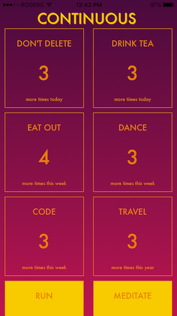
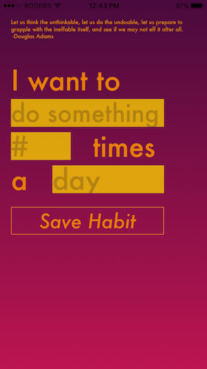
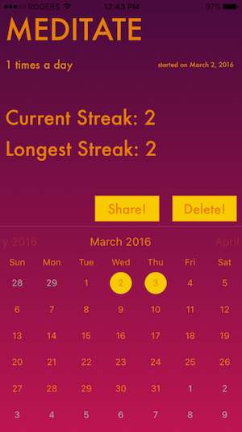
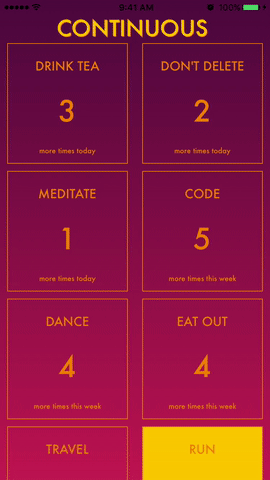

# Continuous
Habit tracking app (Lighthouse Labs Final Project)

  

The app allows you to track habits and set goals (daily/weekly/monthly/yearly) for how frequently you want to do it. It helps you achieve these goals and form habits by displaying all your goals, and telling you how many you have left to do. It will also place “higher priority” goals nearer the top of the grid and goals/habits already done will be at the bottom. 

- Create new habits easily (TheySaidSo API for inspirational quotes, local saving using Realm)
- Displays habits on collection view, easily update progress (gesture-based UI)
- Habits are dynamically sorted by priority, with finished ones put at the bottom, progress reset automatically updated daily/weekly/month/yearly
- Detail view of each habit to display dates done (using FSCalendar), current streak, longest streak, date started
- Social sharing of habits & progress view UIActivityViewController
- Local push notifications with actions (ex. "Did you run today?" Yes/No to update progress without opening app)

Demoed on March 3, 2016
